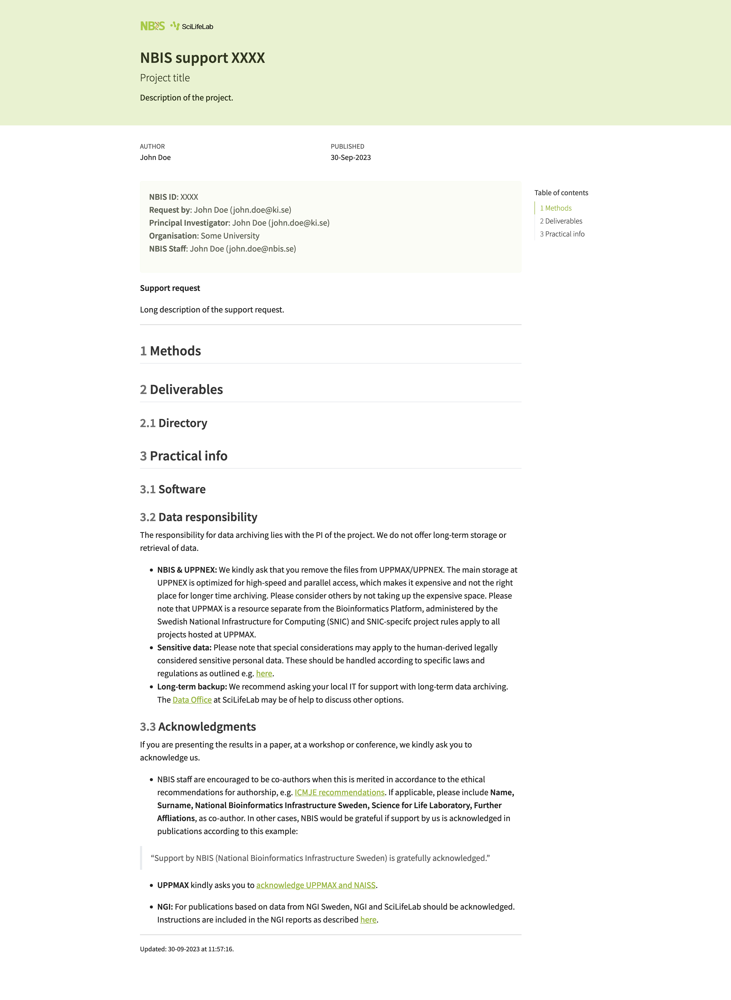

# minty <span><a href="https://github.com/royfrancis/minty-quarto-webpage"></a></span> 

[](https://github.com/royfrancis/minty-quarto-webpage/actions?workflow=deploy)    [](https://lifecycle.r-lib.org/articles/stages.html#experimental)

A single page quarto html template for project reports. For a multi-page website template, see [minty-quarto-website](https://github.com/royfrancis/minty-quarto-website).



For a demo page, see [here](http://royfrancis.github.io/minty-quarto-webpage).

## Usage

- Required quarto 1.2.2 or higher
- Run in the terminal to initialise the boilerplate template

```
quarto use template royfrancis/minty-quarto-webpage
```

- Launch preview in the browser

```
quarto preview index.qmd
```

- Render

```
quarto render index.qmd
```

## Tips

- Template directory structure

```
.
├── assets
├── _extensions
└── index.qmd
```

- Update `author: "John Doe"`
- Use `##` as the highest level heading.
- The output html is intended to be standalone with no child assets. To disable this set:

```
standalone: false
embed-resources: false
```

## Acknowledgements

- Built using [Quarto](https://quarto.org/)
- Uses the [lightbox extension](https://github.com/quarto-ext/lightbox) for viewing images
- Uses the [fontawesome extension](https://github.com/quarto-ext/fontawesome) to include fontawesome icons

---

2023 • Roy Francis