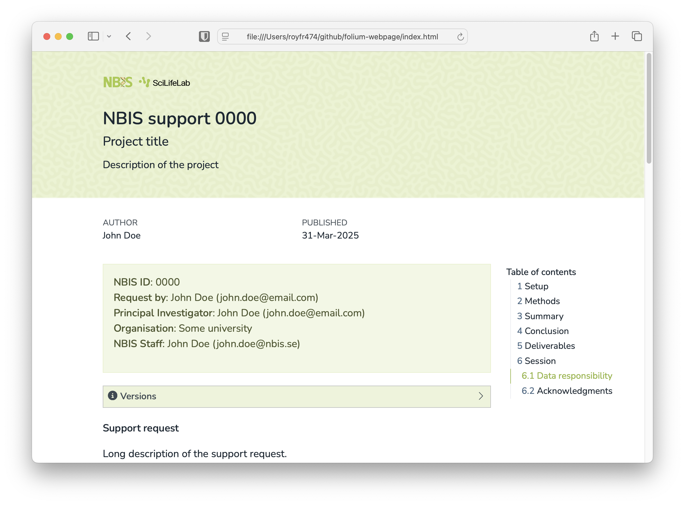

# folium-webpage <span><a href="https://github.com/royfrancis/folium-webpage"></a></span>

[](https://github.com/royfrancis/folium-webpage/actions?workflow=deploy)  [](https://github.com/royfrancis/folium-webpage/actions?workflow=linkcheck)  

This is a single page quarto html template for project reports. For a multi-page website template, see [folium](https://github.com/royfrancis/folium).



For a demo page, see [here](http://royfrancis.github.io/folium-webpage).

## Usage

- Required quarto 1.4.549 or higher
- To download a starter template, run in terminal:

```
quarto use template royfrancis/folium-webpage
```

- Launch preview in the browser

```
quarto preview index.qmd
```

- Render

```
quarto render index.qmd
```

## Tips

- Template directory structure

```
.
├── assets
├── _extensions
└── index.qmd
```

- Update `nbis` meta variables
- Use `##` as the highest level heading.
- The output html is intended to be standalone with no child assets. To disable this set:

```
standalone: false
embed-resources: false
```

## Acknowledgements

- Built using [Quarto](https://quarto.org/)
- Uses the [fontawesome extension](https://github.com/quarto-ext/fontawesome) to include fontawesome icons

---

2025 • Roy Francis
